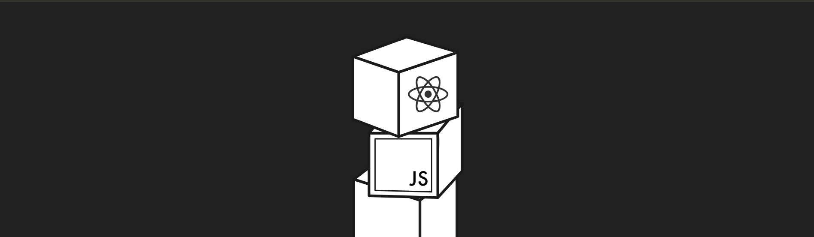

# 👨‍💻 [FullStack Course by Helsinki 2023](https://fullstackopen.com/en/) 👨‍💻

| **_Part no._** 	| **_Part name_**                                              	| **_Link_**                                                                                           	| **_Topics Covered_**                                                                                             	|
|----------------	|--------------------------------------------------------------	|------------------------------------------------------------------------------------------------------	|------------------------------------------------------------------------------------------------------------------	|
| Part 0         	| Fundamentals of Web apps                                     	| [Link](https://github.com/VanshSh/fullstack_course_by_university_of_helsinki/tree/master/part0) 	| - React                                                                                                          	|
| Part 1         	| Introduction to React                                        	| [Link](https://github.com/VanshSh/fullstack_course_by_university_of_helsinki/tree/master/part1) 	|                                                                                                                  	|
| Part 2         	| Communicating with server                                    	| [Link](https://github.com/VanshSh/fullstack_course_by_university_of_helsinki/tree/master/part2) 	|                                                                                                                  	|
| Part 3         	| Programming a server with NodeJS and Express                 	| [Link](https://github.com/VanshSh/phonebook-backend)                                            	|                                                                                                                  	|
| Part 4         	| Testing Express servers, user administration                 	| [Link](https://github.com/VanshSh/blog-app-backend)                                             	| - JSON Web Token - Lodash - Bcrypt - mongoose-unique-validator - Express Async Errors - Supertest 	|
| Part 5         	| Testing React apps                                           	| [Link](https://github.com/VanshSh/bloglist-frontend-main)                                       	| - Cypress - JEST - JEST DOM - Prop Types                                                                	|
| Part 6         	| Advanced state management                                    	| [Link](https://github.com/VanshSh/part6-all-exercise-uoh)                                       	| - Redux - Deep freeze   - Deep-freeze  - React Redux - Axios - React Query                        	|
| Part 7         	| React router, custom hooks, styling app with CSS and webpack 	| [Link](https://github.com/VanshSh/part-7-exercises)                                             	| - Router - Bootstrap - Material UI - Styled Components - Webpack - Check npm package              	|
| Part 8         	| GraphQL                                                      	| [Link](https://github.com/VanshSh/part-8-graphql)                                               	| - GraphQL - Apollo Server - Apollo Client                                                                  	|
| Part 9         	| TypeScript                                                   	|                                                                                                      	|                                                                                                                  	|